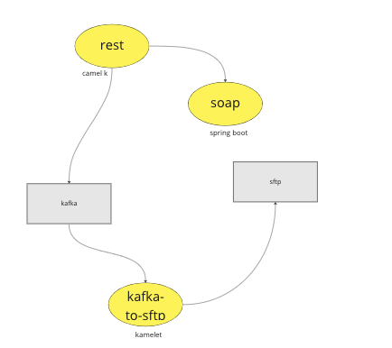

= Scenario

Scenario is illustrated in the figure below:

* Camel with Spring Boot exposes two SOAP services: `hello` and `echo``
** `SampleRoute` includes the route for `echo`
* Camel K exposes a rest service (using an open api spec)
** Does data transformation with atlasmap
** Call `echo` soap end point
** Does xml to json transformation with atlasmap
** Sends the response to Kafka
* Kamelet to get the message from kafka and sends it to sftp server

= Atlasmap:
- https://repo1.maven.org/maven2/io/atlasmap/atlasmap-standalone/2.3.2/atlasmap-standalone-2.3.2.jar

= References
- https://www.enterpriseintegrationpatterns.com/
- https://developers.redhat.com/articles/2022/03/16/choose-best-camel-your-integration-ride-part-3

== Camel Tutorial
- https://tomd.xyz/camel-tutorial/

== Component Reference
- https://access.redhat.com/webassets/avalon/d/red_hat_integration/2021.q3/apache-camel-3.10-doc/components/latest/atlasmap-component.html
- https://access.redhat.com/webassets/avalon/d/red_hat_integration/2021.q3/apache-camel-3.10-doc/components/latest/index.html
